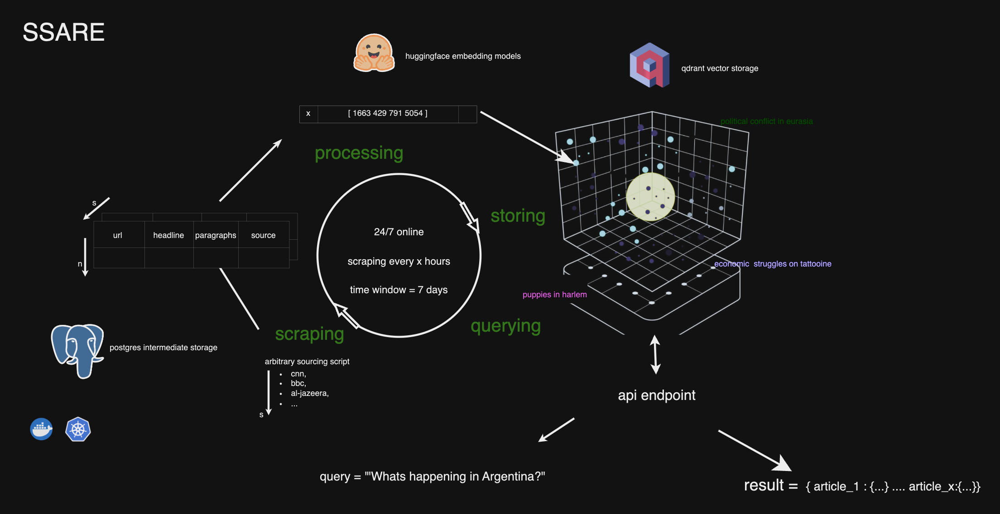

# SSARE 
🌐🔍🪡 Finding the needle in the haystack
# Semantic Search Article Recommendation Engine
Always up-to-date news RAG endpoint for semantic search and article recommendations.
Also: a solution for data scientists and their needs for up-to-date political news datasets.


## Introduction
SSARE stands for Semantic Search Article Recommendation Engine, an open-source service that comfortably orchestrates scraping, processing into vector representations, storing and querying of news articles. 

SSARE serves as an efficient and scalable resource for semantic search and article recommendations, catering primarily to political news data.

It is: 
- A tool to create a dataset, e.g. for source-x in the timeframes y-z
- A consistently updated vector storage for political news articles (especially suited for LLM/ RAG use cases)
- Designed for easy addition of new sources
- A scalable and maintainable solution for political news data


**SSARE is an always up to date political news RAG endpoint.**

The engine is adaptable to various sources, requiring only a sourcing script that outputs the data in the format of a dataframe with the columns:
| url | headline | paragraphs | source |

Once integrated, SSARE processes these articles using embeddings models of your choice(upcoming, currently hardcoded), stores their vector representations in a Qdrant vector database, and maintains a full copy in a PostgreSQL database. You can store different snapshots of the data in the PostgreSQL (upcoming).

SSARE is a composition of microservices to make this project a scalable and maintainable solution.

This is a high-level overview of the architecture:



For a more detailed overview, please refer to the [Architecture and Storage](#architecture-and-storage) section.


### Project Purpose and philosophy
This project is designed for researchers, journalists, and activists who require a comprehensive and up-to-date database of political news articles.
Researchers often build these solutions from handcrafted scripts, which are difficult to maintain and scale. SSARE aims to provide a scalable and maintainable solution for political news data.


## Getting Started

Ensure Docker and docker-compose are installed.

Then:

1. Download the source code by cloning the repository.
    ```bash
    git clone https://github.com/JimVincentW/SSARE.git
    ``` 

2. Initiate the setup:
   ```bash
   cd SSARE
   docker-compose up --build
   ```
   
3. Execute the initial setup script:
   ```bash
   python full.py
   ```
   Wait (initial scraping/ processing may take a few minutes).

4. Query the API:
   ```bash
   curl -X GET "http://127.0.0.1:6969/search?query=Argentinia&top=5"
   ```

If you want to use the UI:
1. Go to http://localhost:8080 in your browser after you ran the setup script.
2. Trigger a scraping run.
3. Wait for the scraping to finish.
4. Use the search bar to query for articles.


## Practical Instructions

### Add your data source in 3 steps
1. 
Insert any sourcing or scraping script into the scraper_service/scrapers folder. 
A simple scraping script can look like this:
```python
import asyncio
import pandas as pd
from bs4 import BeautifulSoup
import aiohttp


async def scrape_cnn_articles(session):
    base_url = 'https://www.cnn.com'
    async with session.get(base_url) as response:
        data = await response.text()
        soup = BeautifulSoup(data, features="html.parser")
        all_urls = [base_url + a['href'] for a in soup.find_all('a', href=True) 
                    if a['href'] and a['href'][0] == '/' and a['href'] != '#']

    def url_is_article(url, current_year='2024'):
        return 'cnn.com/{}/'.format(current_year) in url and '/politics/' in url

    article_urls = [url for url in all_urls if url_is_article(url)]
    tasks = [process_article_url(session, url) for url in article_urls]
    articles = await asyncio.gather(*tasks)
    return pd.DataFrame(articles, columns=['url', 'headline', 'paragraphs'])

# Async function to process each article URL
async def process_article_url(session, url):
    try:
        async with session.get(url) as response:
            article_data = await response.text()
            article_soup = BeautifulSoup(article_data, features="html.parser")
            headline = article_soup.find('h1', class_='headline__text')
            headline_text = headline.text.strip() if headline else 'N/A'
            article_paragraphs = article_soup.find_all('div', class_='article__content')
            cleaned_paragraph = ' '.join([p.text.strip() for p in article_paragraphs])
            print(f"Processed {url}")
            
            return url, headline_text, cleaned_paragraph
    except Exception:
        return url, 'N/A', ''


async def main():
    async with aiohttp.ClientSession() as session:
        df = await scrape_cnn_articles(session)
        df.to_csv('/app/scrapers/data/dataframes/cnn_articles.csv', index=False)
        df.head(3)


if __name__ == "__main__":
    asyncio.run(main())
```

2. Make the script save the dataframe to the /app/scrapers/data/dataframes folder. 
Give your dataframe the name of the source, e.g. Times of India -> timesofindia_articles.csv, CNN -> cnn_articles.csv, etc.
````bash
/app/scrapers/data/dataframes/{source}_articles.csv'
````
3. Add the source to the scrapers_config.json file in the /app/scrapers folder.
```json
{
    "scrapers": {
        "cnn": {
            "location": "scrapers/cnn.py",
        },
	"bbc": {
	    "location": "scrapers/bbc.py",
	},
    "timesofindia": {
        "location": "scrapers/timesofindia.py",
    }
}
```


SSARE will execute all scripts in the scrapers folder and process the articles. 
They are vectorized and stored in a Qdrant vector database.

The API endpoint can be queried for semantic search and article recommendations for your LLM or research project.

If your additional scripts need scraping libraries other than BeautifulSoup, please add them to the requirements.txt file in the scraper_service folder (and create a pull request). 

If you want to use your own embeddings models, you need to change the dim size in the code of the qdrant service and the model name in the nlp service (this whill be streamlined in the future).


## Upcoming Features

### Future Roadmap
#### Short-term
- [ ] Customisable embeddings models
- [ ] Eportable Copy of datascraping datasets
- [ ] Customisable timeframes for scraping

#### Long-term
- [ ] "Flavours" of information spaces - e.g. catering to different geographic or disciplinary areas
- [ ] Custom 7b model for comprehensive labeling and summarization tasks


### Participation: Script Contributions
We welcome contributions from passionate activists, enthusiastic data scientists, and dedicated developers. Your expertise can greatly enhance our repository, expanding the breadth of our political news coverage. 


## Important Notes
Current limitations include the limited number of scrapers, alongside the unavailability of querying the postgres database directly.
This is a non-profit research project. I am a student at the OSI department of political science at the Free University Berlin. 


## Architecture and Storage
SSARE's architecture fosters communication through a decoupled microservices design, ensuring scalability and maintainability.Redis stores task queues. The system is composed of the following services:
-  Scraper Service
-  Vectorization/NLP Service
-  Qdrant Service
-  PostgreSQL Service
-  API Service

Services communicate and signal each other by producing flags and pushings tasks and data to Redis queues.

The scrape jobs are parallelized with Celery.

Regarding storage, SSARE employs PostgreSQL for data retention and Qdrant as a vector storage.


## Licensing
SSARE is distributed under the MIT License, with the license document available for reference within the project repository.